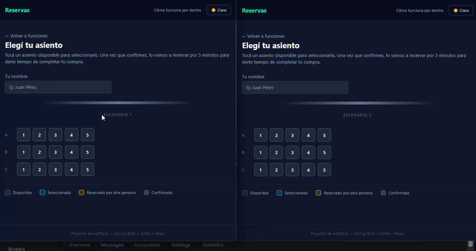
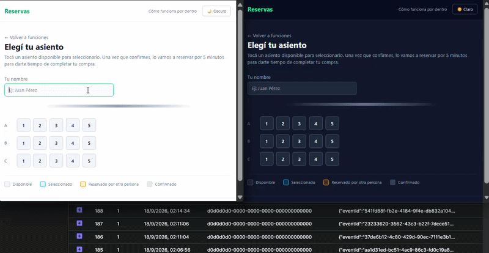
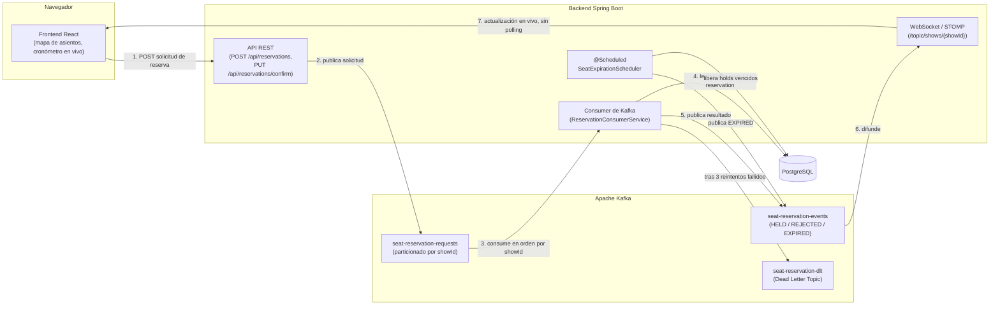

# Sistema de Reservas de Asientos — Control de Concurrencia con Kafka

> 🇬🇧 [English version](README.md)

Sistema de reservas de asientos estilo cine, construido como proyecto de portfolio para aprender y demostrar **control de concurrencia orientado a eventos con Apache Kafka**. Varios usuarios pueden intentar reservar el mismo asiento al mismo tiempo — el particionamiento de Kafka garantiza que exactamente uno gane, sin bloquear la base de datos directamente.

**Escenario 1 — Dos usuarios, dos asientos distintos (sin contienda).** Cada solicitud se procesa de forma independiente; los dos holds se confirman sin fricción, y cada navegador ve en vivo por WebSocket el asiento que reservó el otro.



**Escenario 2 — Dos usuarios, mismo asiento, casi simultáneo (contienda real).** Las dos solicitudes entran a `seat-reservation-requests` casi juntas; el particionamiento de Kafka por `showId` las procesa en orden estricto, así que exactamente una gana (`HELD`) y la otra se rechaza en vivo — visible tanto en los navegadores como en el tópico `seat-reservation-events` de Kafka UI.



## Índice

- [Por qué este proyecto](#por-qué-este-proyecto)
- [Arquitectura](#arquitectura)
- [Flujo de reserva](#flujo-de-reserva)
- [Decisiones de diseño clave y lecciones aprendidas](#decisiones-de-diseño-clave-y-lecciones-aprendidas)
- [Stack tecnológico](#stack-tecnológico)
- [Testing](#testing)
- [Limitaciones conocidas (alcance consciente, no descuidos)](#limitaciones-conocidas-alcance-consciente-no-descuidos)
- [Cómo correrlo localmente](#cómo-correrlo-localmente)
- [Estructura del proyecto](#estructura-del-proyecto)
- [Posibles próximos pasos](#posibles-próximos-pasos)

## Por qué este proyecto

Este es un proyecto personal de portfolio, no comercial, con tres objetivos explícitos:

1. Aprender cómo funciona la transmisión de eventos con Kafka de forma práctica, no solo en teoría.
2. Tener un repo de GitHub presentable para portfolio/CV.
3. Desplegar todo en AWS para demostrar habilidades de despliegue en la nube, además de backend/frontend.

El dominio elegido (reservas de asientos) se eligió específicamente porque genera **conflictos de concurrencia reales** — muchas personas pueden intentar reservar el mismo asiento con milisegundos de diferencia, lo que hace que los conceptos de Kafka de abajo sean observables, no solo teóricos.

## Arquitectura



**¿Por qué REST + Kafka, y no solo REST?** El endpoint REST solo *envía* una solicitud de reserva — no decide el resultado. La decisión real (disponible o no) ocurre de forma asíncrona en el consumer de Kafka, que es el único que toca la fila `Seat` para un `showId` determinado. Esto convierte "muchas personas hacen click a la vez" de un problema de locking de base de datos en un problema de **orden de mensajes**, que Kafka resuelve naturalmente mediante particionamiento (ver más abajo).

**¿Por qué WebSocket además de Kafka?** Kafka es la columna vertebral entre componentes del backend; el navegador no puede suscribirse directamente a un tópico de Kafka. El consumer republica cada resultado por STOMP/WebSocket para que el frontend reciba actualizaciones en vivo (otro usuario tomando "tu" asiento, un hold que expira) sin hacer polling.

## Flujo de reserva

1. El usuario abre un mapa de asientos (`GET /api/shows/{showId}/seats`) y hace click en uno disponible — esto solo actualiza el estado local de la UI, todavía no se envía ninguna solicitud.
2. El usuario hace click en **"Confirmar reserva"**, lo que dispara `POST /api/reservations`. El backend publica un evento de solicitud en `seat-reservation-requests`, con `showId` como key.
3. El consumer procesa el evento **en orden estricto por `showId`** (particionamiento de Kafka): si el asiento está `AVAILABLE`, lo retiene por 5 minutos (`HELD`, con `heldBy`/`heldUntil`); si no, publica `REJECTED` con un motivo. Ningún intento se procesa nunca fuera de orden respecto a uno anterior para la misma función.
4. El resultado se publica en `seat-reservation-events` y se empuja en vivo a cada navegador conectado vía WebSocket — el usuario que perdió la carrera ve el asiento pasar a tomado en tiempo real, no recién al refrescar.
5. Si el hold no se confirma dentro de los 5 minutos, un job programado (`SeatExpirationScheduler`, cada 30s) libera el asiento de vuelta a `AVAILABLE` y publica `EXPIRED`.
6. Si el usuario confirma a tiempo, `PUT /api/reservations/confirm` pasa el asiento directo a `CONFIRMED`. Este paso es síncrono (no pasa por Kafka) porque a esa altura ya no queda contienda que resolver — el usuario ya ganó el hold.
7. Si una solicitud no se puede procesar tras 3 reintentos (por ejemplo, datos mal formados), termina en `seat-reservation-dlt`, el Dead Letter Topic, en vez de bloquear o descartar el mensaje silenciosamente.

Máquina de estados: `AVAILABLE → HELD → CONFIRMED`, con `HELD → AVAILABLE` por expiración.

## Decisiones de diseño clave y lecciones aprendidas

Esta sección es la parte de mayor valor del repo para un portfolio — son bugs y decisiones reales encontrados al construirlo, no un relato prolijo armado después.

### Particionamiento por `showId`, no por `seatId`

Los tres tópicos están particionados por `showId`. Esto significa que todos los eventos de una misma función se procesan **en el orden en que se produjeron, por un solo thread consumer**, lo que serializa solicitudes en competencia por el mismo asiento *antes* de que lleguen a la base de datos. En la práctica, esto hizo que los conflictos explícitos de `OptimisticLockingFailureException` casi desaparecieran — dos personas peleando por el mismo asiento se resuelven como "el primero en la partición gana", no como una carrera a nivel de base de datos. El optimistic locking (`@Version` en `Seat`) se mantiene como una red de seguridad de defensa en profundidad para escenarios menos comunes (reasignación de particiones en pleno procesamiento, otros orígenes de escritura), no como el mecanismo principal de concurrencia.

### Idempotencia vs. reintentos automáticos: el orden de las operaciones importa

El consumer chequea `processedEventRepository.existsById(eventId)` antes de hacer nada, para evitar reprocesar un mensaje redelivered. La primera implementación persistía ese marcador de "procesado" *antes* de lanzar la excepción en un error reintentable — lo que rompía silenciosamente el mecanismo del Dead Letter Topic: en el segundo y tercer reintento, el propio chequeo de idempotencia cortaba el método, y el `DefaultErrorHandler` de Spring interpretaba eso como "recuperado con éxito", así que nunca llegaba a invocar al recoverer del DLT. **La corrección**: mover la escritura del marcador al propio recoverer, para que se dispare una sola vez, recién cuando se agotaron todos los reintentos y el mensaje se recupera de verdad hacia el DLT. Lección general: cuando idempotencia y reintentos automáticos interactúan, el momento exacto en que se persiste el marcador de "éxito" determina si los dos mecanismos cooperan o se cancelan silenciosamente entre sí.

### `KafkaConnectionDetails` — el bug más importante del proyecto

Por un conflicto entre Jackson 2.x y 3.x (ver más abajo), los beans de producer/consumer de Kafka se construyen a mano en vez de depender de la autoconfiguración de Spring Boot. Eso también significaba que originalmente leían `spring.kafka.bootstrap-servers` directo vía `@Value`. El `@ServiceConnection` de Testcontainers funciona registrando un bean `KafkaConnectionDetails` que consulta la **autoconfiguración estándar** de Spring Boot — pero como este proyecto no usa esa autoconfiguración para Kafka, el override nunca se aplicaba. Resultado real: los tests de integración corrían contra el Kafka real y persistente en vez del efímero de Testcontainers, y ningún test fallaba por eso — confirmado al encontrar mensajes de prueba (`usuario-0`, `usuario-dlt`, etc.) mezclados en el tópico real. **Fix**: inyectar `KafkaConnectionDetails` explícitamente en vez de leer la property cruda. **Lección general y reusable**: cualquier bean de integración externa construido a mano (no solo Kafka) necesita inyectar el `XxxConnectionDetails` correspondiente si se quiere que `@ServiceConnection` funcione de verdad en los tests — es un patrón general de Spring Boot 3.1+, no algo específico de este proyecto.

### Jackson 2.x y 3.x conviviendo a propósito

Spring Boot 4.1 usa Jackson 3.x por defecto (`tools.jackson.core`), pero el `JsonSerializer` de Spring Kafka todavía espera el Jackson 2.x clásico (`com.fasterxml.jackson.databind`). Se agregaron ambos como dependencias explícitas; como viven en paquetes Java distintos, conviven en el classpath sin conflicto. La serialización de `Instant`/`LocalDateTime` también necesitó registrar `JavaTimeModule` a mano sobre un `ObjectMapper` explícito — Spring no lo auto-registra para el serializer de Kafka como sí lo hace para el `ObjectMapper` principal de REST.

### Dead Letter Topic: destino explícito, no el default

El `DeadLetterPublishingRecoverer` se configuró con un destino explícito (`seat-reservation-dlt`, partición 0) en vez del comportamiento por defecto de Spring de agregar `.DLT` al nombre del tópico original — de lo contrario crea silenciosamente un tópico nuevo no planeado en vez de usar el que ya estaba diseñado para eso.

### `fixedDelay`, no `fixedRate`, para el scheduler de expiración

El job de expiración de asientos usa `@Scheduled(fixedDelay = 30000)` en vez de `fixedRate`. Con `fixedRate`, un ciclo lento podría superponerse con el siguiente, causando que dos ejecuciones compitan sobre las mismas filas y disparen `OptimisticLockingFailureException` contra sí mismo, no por contienda real. `fixedDelay` siempre espera a que termine un ciclo antes de programar el próximo.

### Los rechazos no se persisten

Cuando se rechaza una reserva (asiento no disponible), no se escribe ninguna fila en `reservations` — la traza completa de todos los intentos, exitosos o no, ya vive en el tópico `seat-reservation-events`, que se trata como la fuente de verdad del historial. Esto mantiene el modelo relacional simple (solo reservas reales/efectivas) y evitó agregar estados al enum únicamente por trazabilidad que Kafka ya provee.

### Un hold por usuario, por función — no global

Un usuario puede retener como máximo un asiento por función a la vez (validado del lado del servidor, no solo en la UI). Es una decisión pragmática que refleja la ausencia de autenticación real (`userId` es solo un identificador generado del lado del cliente), no una limitación técnica — ver [Limitaciones conocidas](#limitaciones-conocidas-alcance-consciente-no-descuidos).

## Stack tecnológico

**Backend**: Java 21, Spring Boot 4.1, Spring Kafka, Spring Data JPA, Flyway, PostgreSQL 16, Apache Kafka (modo KRaft, sin Zookeeper).

**Frontend**: React 19, Vite, Tailwind CSS v4, React Router, STOMP sobre SockJS para WebSocket.

**Testing**: JUnit 5, Testcontainers (Kafka + PostgreSQL reales y efímeros, patrón singleton-container).

**Infraestructura**: AWS EC2 (Amazon Linux 2023), Docker Compose para Kafka/PostgreSQL/Kafka UI, todo desarrollado y corrido enteramente desde el navegador (AWS Systems Manager Session Manager + code-server).

## Testing

11 tests de integración, todos verdes, corridos contra Kafka y PostgreSQL reales (y efímeros) vía Testcontainers — sin mocks para la capa de infraestructura:

- Concurrencia de asientos: 10 solicitudes simultáneas por el mismo asiento, exactamente una gana.
- Máquina de estados completa sin contienda (camino feliz).
- Dead Letter Topic: un `seatId` inválido agota los reintentos y termina en el DLT.
- Regla de un hold por usuario por función.
- Scheduler de expiración liberando un asiento retenido.
- Cuatro escenarios de conflicto de confirmación (asiento inexistente, estado incorrecto, usuario incorrecto, hold ya vencido).
- Idempotencia genuina: redelivery del mismo `eventId` no genera duplicados.

```bash
./mvnw test
# Tests run: 11, Failures: 0, Errors: 0
```

## Limitaciones conocidas (alcance consciente, no descuidos)

Son decisiones documentadas, tomadas deliberadamente dado el alcance de portfolio del proyecto — no cosas que se pasaron por alto:

- **Sin autenticación real.** `userId` es un identificador generado del lado del cliente (guardado en `localStorage`), no respaldado por un sistema de login. En un sistema de producción se reemplazaría por autenticación basada en JWT/OAuth.
- **El límite de un hold por usuario es por función, no global.** Una simplificación pragmática, consecuencia directa de no tener autenticación real que permita reforzar una identidad más fuerte entre funciones distintas.
- **Recargar la página hace perder el conocimiento del cliente de "este asiento es mío".** El backend mantiene correctamente el asiento en `HELD` y sigue visto como tomado por todos, pero la pestaña que se recarga pierde su propio cronómetro/botón de confirmar hasta que el hold expire solo — el estado de "esto es mío" vive solo en memoria de React, no persistido. Una solución conocida sería extender el uso ya existente de `localStorage` (ya usado para `userId`) para recordar el asiento activo del usuario.
- **`SeatExpirationScheduler` asume una sola instancia del backend.** No escribe un marcador de idempotencia como sí hace el consumer de Kafka, porque con una sola instancia no existe el escenario de redelivery del que protegerse; el optimistic locking sobre `Seat` seguiría protegiendo la integridad de los datos si esto cambiara, pero correr 2+ réplicas del backend ameritaría revisar si el scheduler necesita coordinación adicional (por ejemplo, un lock distribuido).

## Cómo correrlo localmente

El proyecto se desarrolló y desplegó enteramente en una única instancia EC2 de AWS, pero corre igual localmente:

```bash
# 1. Levantar Kafka (modo KRaft) + PostgreSQL
cd infra
cp .env.example .env
# editá .env y poné tu propio POSTGRES_PASSWORD
docker compose up -d

# 2. Correr el backend (desde la raíz del proyecto)
cd reservas-app
export $(grep -v '^#' ../infra/.env | xargs)
./mvnw spring-boot:run
# Backend en http://localhost:8080

# 3. Correr el frontend
cd reservas-frontend
npm install
npm run dev
# Frontend en http://localhost:3000
```

Requisitos: Java 21, Node 20+, Docker.

## Estructura del proyecto

```
reservas-app/            # Backend Spring Boot
├── domain/              # Show, Seat, Reservation + enums de estado
├── event/               # Payloads de eventos de Kafka
├── repository/          # Repositorios de Spring Data JPA
├── service/             # Consumer, event publisher, scheduler de expiración
├── controller/          # Endpoints REST
└── config/              # Producer/consumer de Kafka, WebSocket, CORS

reservas-frontend/       # Frontend React + Vite + Tailwind
├── src/pages/           # Selector de función, mapa de asientos, página "cómo funciona"
└── src/...              # Cliente WebSocket, componentes del mapa de asientos
```

## Posibles próximos pasos

- Autenticación real (JWT/OAuth) en vez de un `userId` generado del lado del cliente.
- Persistir del lado del cliente el asiento actualmente retenido, para sobrevivir a un recargado de página.
- Una entidad/endpoint de listado de `Show` real, en vez de una única función hardcodeada.
- Mecanismo de coordinación para el scheduler de expiración si se escala a múltiples instancias del backend.
