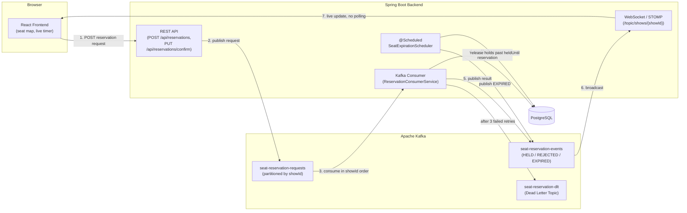

# Seat Reservation System — Kafka-based Concurrency Control

> 🇪🇸 [Versión en español](README.es.md)

A cinema-style seat reservation system built as a portfolio project to learn and demonstrate **event-driven concurrency control with Apache Kafka**. Multiple users can try to reserve the same seat at the same time — Kafka partitioning guarantees exactly one of them wins, without locking the database directly.

**Scenario 1 — Two users, two different seats (no contention).** Each request is processed independently; both holds succeed and each browser sees the other's seat update live over WebSocket.


**Scenario 2 — Two users, same seat, near-simultaneous (real contention).** Both requests land in `seat-reservation-requests` almost together; Kafka partitioning by `showId` processes them in strict order, so exactly one succeeds (`HELD`) and the other is rejected live — visible both in the browsers and in Kafka UI's `seat-reservation-events` topic.


## Table of contents

- [Why this project](#why-this-project)
- [Architecture](#architecture)
- [Reservation flow](#reservation-flow)
- [Key design decisions & lessons learned](#key-design-decisions--lessons-learned)
- [Tech stack](#tech-stack)
- [Testing](#testing)
- [Known limitations (conscious scope, not oversights)](#known-limitations-conscious-scope-not-oversights)
- [Running locally](#running-locally)
- [Project structure](#project-structure)
- [Possible next steps](#possible-next-steps)

## Why this project

This is a personal, non-commercial portfolio project with three explicit goals:

1. Learn how event streaming with Kafka works in practice, not just in theory.
2. Have a presentable GitHub repo for a CV/portfolio.
3. Deploy the whole system on AWS to show cloud deployment skills as well as backend/frontend skills.

The domain (seat reservations) was chosen specifically because it creates **real concurrency conflicts** — many people can try to book the same seat within milliseconds of each other, which makes the Kafka concepts below observable, not just theoretical.

## Architecture



**Why REST + Kafka, not just REST?** The REST endpoint only *submits* a reservation request — it doesn't decide the outcome. The actual decision (available vs. already taken) happens asynchronously in the Kafka consumer, which is the only place that touches the `Seat` row for a given `showId`. This turns "many people click at once" from a database locking problem into a **message ordering** problem, which Kafka solves naturally through partitioning (see below).

**Why WebSocket in addition to Kafka?** Kafka is the backbone between backend components; the browser can't subscribe to a Kafka topic directly. The consumer republishes every result over STOMP/WebSocket so the frontend gets live updates (another user taking "your" seat, a hold expiring) without polling.

## Reservation flow

1. User opens a seat map (`GET /api/shows/{showId}/seats`) and clicks an available seat — this only updates local UI state, no request is sent yet.
2. User clicks **"Confirm reservation"**, which fires `POST /api/reservations`. The backend publishes a request event to `seat-reservation-requests`, keyed by `showId`.
3. The consumer processes the event **in strict order per `showId`** (Kafka partitioning): if the seat is `AVAILABLE`, it holds it for 5 minutes (`HELD`, with `heldBy`/`heldUntil`); if not, it publishes `REJECTED` with a reason. No new attempt is ever processed out of order relative to an earlier one for the same show.
4. The result is published to `seat-reservation-events` and pushed live to every connected browser over WebSocket — the user who lost the race sees the seat turn taken in real time, not after a refresh.
5. If the hold isn't confirmed within 5 minutes, a scheduled job (`SeatExpirationScheduler`, every 30s) releases the seat back to `AVAILABLE` and publishes `EXPIRED`.
6. If the user confirms in time, `PUT /api/reservations/confirm` moves the seat straight to `CONFIRMED`. This step is synchronous (no Kafka) since there's no contention left to resolve at that point — the user already won the hold.
7. If a request can't be processed after 3 retries (e.g. malformed data), it lands in `seat-reservation-dlt`, the Dead Letter Topic, instead of blocking or silently dropping the message.

State machine: `AVAILABLE → HELD → CONFIRMED`, with `HELD → AVAILABLE` on expiration.

## Key design decisions & lessons learned

This section is the most valuable part of the repo for a portfolio — these are real bugs and trade-offs found while building it, not a curated "clean" retelling.

### Partitioning by `showId`, not `seatId`

All three topics are partitioned by `showId`. This means every event for a given show is processed **in the order it was produced, by a single consumer thread**, which serializes competing requests for the same seat *before* they ever reach the database. In practice, this made explicit `OptimisticLockingFailureException` conflicts almost disappear — two people fighting for the same seat get resolved as "first in the partition wins", not as a database-level race. Optimistic locking (`@Version` on `Seat`) is kept as a defense-in-depth safety net for less common scenarios (partition reassignment mid-processing, other write paths), not as the primary concurrency mechanism.

### Idempotency vs. automatic retries: order of operations matters

The consumer checks `processedEventRepository.existsById(eventId)` before doing anything, to avoid reprocessing a redelivered message. The first implementation persisted that "processed" marker *before* throwing on a retryable error — which quietly broke the Dead Letter Topic mechanism: by the second and third retry, the idempotency check itself would short-circuit the method, and Spring's `DefaultErrorHandler` interpreted that as "recovered successfully", so it never actually invoked the DLT recoverer. **The fix**: move the marker write into the recoverer itself, so it only fires once, after all retries are exhausted and the message is genuinely dead-lettered. General lesson: when idempotency and automatic retries interact, *when* you persist the "success" marker determines whether the two mechanisms cooperate or silently cancel each other out.

### `KafkaConnectionDetails` — the most important bug in the project

Because of a Jackson 2.x/3.x conflict (see below), the Kafka producer/consumer beans are built by hand instead of relying on Spring Boot's autoconfiguration. That also meant they originally read `spring.kafka.bootstrap-servers` directly via `@Value`. Testcontainers' `@ServiceConnection` works by registering a `KafkaConnectionDetails` bean that Spring Boot's **standard autoconfiguration** consults — but since this project bypasses that autoconfiguration for Kafka, the override was silently ignored. Result: integration tests ran against the real, persistent Kafka instance instead of the ephemeral Testcontainers one, and nothing failed loudly — confirmed by finding leftover test messages (`usuario-0`, `usuario-dlt`, etc.) mixed into the production-like topic. **Fix**: inject `KafkaConnectionDetails` explicitly instead of reading the raw property. **General, reusable lesson**: any hand-built bean for an external integration (not just Kafka) needs to consume the matching `XxxConnectionDetails` if you want `@ServiceConnection` to actually take effect in tests — this is a general Spring Boot 3.1+ pattern, not something specific to this project.

### Jackson 2.x and 3.x coexisting on purpose

Spring Boot 4.1 defaults to Jackson 3.x (`tools.jackson.core`), but Spring Kafka's `JsonSerializer` still expects classic Jackson 2.x (`com.fasterxml.jackson.databind`). Both were added explicitly as dependencies; since they live in different Java packages, they coexist on the classpath without conflict. `Instant`/`LocalDateTime` serialization also needed `JavaTimeModule` registered by hand on an explicit `ObjectMapper` — Spring doesn't auto-register it for Kafka's serializer the way it does for the main REST `ObjectMapper`.

### Dead Letter Topic: explicit destination, not the default

`DeadLetterPublishingRecoverer` was configured with an explicit target (`seat-reservation-dlt`, partition 0) instead of Spring's default of appending `.DLT` to the original topic name — otherwise it silently creates a new, unplanned topic instead of using the one already designed for it.

### `fixedDelay`, not `fixedRate`, for the expiration scheduler

The seat-expiration job uses `@Scheduled(fixedDelay = 30000)` instead of `fixedRate`. With `fixedRate`, a slow cycle could overlap with the next one, causing two runs to race over the same rows and throw `OptimisticLockingFailureException` against itself, not against real contention. `fixedDelay` always waits for one cycle to finish before scheduling the next.

### Rejected attempts are not persisted

When a reservation is rejected (seat unavailable), no row is written to `reservations` — the full trace of every attempt, successful or not, already lives in the `seat-reservation-events` topic, which is treated as the source of truth for history. This keeps the relational model simple (only real/effective reservations) and avoided adding states to the enum purely for traceability that Kafka already provides.

### One hold per user, per show — not global

A user can hold at most one seat per show at a time (enforced server-side, not just in the UI). This is a pragmatic decision reflecting the lack of real authentication (`userId` is just a client-generated identifier), not a technical limitation — see [Known limitations](#known-limitations-conscious-scope-not-oversights).

### The frontend didn't check who actually held the seat

Discovered while recording the demo GIF: two different browsers each showed the *same* seat as "yours", with the exact same countdown, regardless of which user actually held it. Root cause: `myHeldSeat` only filtered for "any seat currently `HELD`", never comparing `seat.heldBy` against the local `userId` — and the backend's `SeatResponseDto` didn't even expose `heldBy` to check against. **Fix**: exposed `heldBy` in the DTO, and the frontend filter (both on initial load and on live WebSocket updates) now requires `seat.heldBy === userId`. A reminder that "it looks right with one browser tab open" isn't the same as "it's actually scoped per user" — this only surfaced by testing with two simultaneous real clients.

## Tech stack

**Backend**: Java 21, Spring Boot 4.1, Spring Kafka, Spring Data JPA, Flyway, PostgreSQL 16, Apache Kafka (KRaft mode, no Zookeeper).

**Frontend**: React 19, Vite, Tailwind CSS v4, React Router, STOMP over SockJS for WebSocket.

**Testing**: JUnit 5, Testcontainers (real, ephemeral Kafka + PostgreSQL, singleton-container pattern).

**Infrastructure**: AWS EC2 (Amazon Linux 2023), Docker Compose for Kafka/PostgreSQL/Kafka UI, deployed and run entirely through the browser (AWS Systems Manager Session Manager + code-server).

## Testing

11 integration tests, all green, run against real (ephemeral) Kafka and PostgreSQL via Testcontainers — no mocks for the infrastructure layer:

- Seat concurrency: 10 simultaneous requests for the same seat, exactly one wins.
- Full happy-path state machine with no contention.
- Dead Letter Topic: an invalid `seatId` exhausts retries and lands in the DLT.
- One-hold-per-user-per-show rule.
- Expiration scheduler releasing a held seat.
- Four confirmation-conflict scenarios (seat not found, wrong state, wrong user, hold already expired).
- Genuine idempotency: redelivering the same `eventId` doesn't create duplicates.

```bash
./mvnw test
# Tests run: 11, Failures: 0, Errors: 0
```

## Known limitations (conscious scope, not oversights)

These are documented trade-offs, made deliberately given the project's scope as a portfolio piece — not things that were missed:

- **No real authentication.** `userId` is a client-generated identifier (stored in `localStorage`), not backed by a login system. In a production system this would be replaced by JWT/OAuth-based auth.
- **One hold per user is scoped per show, not global.** A pragmatic simplification that follows directly from not having real auth to enforce a stronger, cross-show identity.
- **Reloading the page loses the client's knowledge of "this is my seat".** The backend correctly keeps the seat `HELD` and it's still visible as taken to everyone, but the reloading tab loses its own countdown/confirm button until the hold expires — the "this is mine" state lives only in React memory, not persisted. A known fix would be extending the existing `localStorage` usage (already used for `userId`) to remember the user's active seat.
- **`SeatExpirationScheduler` assumes a single backend instance.** It doesn't write an idempotency marker the way the Kafka consumer does, because with one instance there's no redelivery scenario to protect against; optimistic locking on `Seat` would still protect data integrity if this changed, but running 2+ backend replicas would call for revisiting whether the scheduler needs additional coordination (e.g. a distributed lock).

## Running locally

The project was developed and deployed entirely on a single AWS EC2 instance, but it runs the same way locally:

```bash
# 1. Start Kafka (KRaft mode) + PostgreSQL
cd infra
cp .env.example .env
# edit .env and set your own POSTGRES_PASSWORD
docker compose up -d

# 2. Run the backend (from the project root)
cd reservas-app
export $(grep -v '^#' ../infra/.env | xargs)
./mvnw spring-boot:run
# Backend on http://localhost:8080

# 3. Run the frontend
cd reservas-frontend
npm install
npm run dev
# Frontend on http://localhost:3000
```

Requirements: Java 21, Node 20+, Docker.

## Project structure

```
reservas-app/            # Spring Boot backend
├── domain/              # Show, Seat, Reservation + status enums
├── event/               # Kafka event payloads
├── repository/          # Spring Data JPA repositories
├── service/             # Consumer, event publisher, expiration scheduler
├── controller/          # REST endpoints
└── config/              # Kafka producer/consumer, WebSocket, CORS

reservas-frontend/       # React + Vite + Tailwind frontend
├── src/pages/           # Show selector, seat map, "how it works" page
└── src/...              # WebSocket client, seat map components
```

## Possible next steps

- Real authentication (JWT/OAuth) instead of a client-generated `userId`.
- Persist the user's currently-held seat client-side to survive page reloads.
- A real `Show` entity/listing endpoint instead of a single hardcoded show.
- Coordination mechanism for the expiration scheduler if scaled to multiple backend instances.
